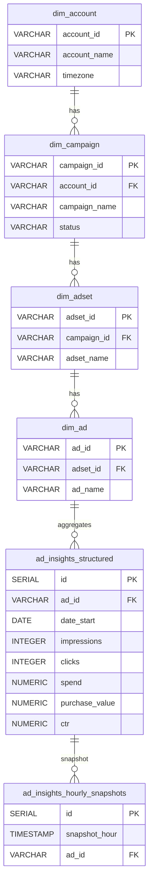
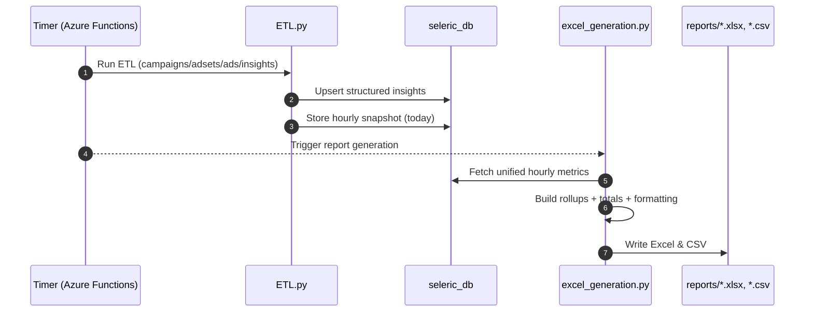

## Report Automation

End-to-end marketing performance pipeline that ingests ad data, stores structured insights, and generates daily Excel/CSV reports with funnel metrics, SKU attribution, and campaign summaries. Designed for automated runs (Azure Functions timer) and on-demand CLI execution.

### Highlights
- **Channels**: Meta Ads (Facebook/Instagram) with optional Google Ads spend injection and Shopify revenue/COGS via unified hourly metrics
- **Outputs**: Excel and CSV daily rollups with campaign/ad/SKU views, totals, formatting, and conditional highlights
- **Scheduler**: Azure Functions timer trigger for hands-free hourly/daily runs; also supports CLI
- **Config**: Environment values pulled from DB (`env_config` table) with local `.env` fallback
- **Timeframes**: Single-day or multi-day windows via `timeframe_config` (globals, env vars, or explicit args)
- **Rounding & presentation**: Key rate and monetary fields rounded to 2 decimals for readability [[memory:8262560]]

---

## Architecture (Data Flow)

```mermaid
flowchart TD
  subgraph Sources
    FB[Meta Marketing API]
    GA[Google Ads (spend)]
    SH[Shopify (orders/revenue/COGS)]
  end

  subgraph ETL
    E1[ETL.py\nFetch & validate\nTransform schemas]
    DB[(seleric_db)]
    S1[Hourly Snapshots]
  end

  subgraph Reporting
    DR[excel_generation.py\nBuild rollups, totals\nFormat & export]
    RPT[[reports/*.xlsx\nreports/*.csv]]
  end

  FB --> E1
  SH --> E1
  E1 --> DB
  DB --> S1
  GA --> DR
  DB --> DR
  DR --> RPT
```

### Core Tables (high-level)



---

## Features

- **Database-backed configuration**: Loads env vars from `env_config` table with `.env` fallback (see `env_config.py`, `global_config.py`).
- **Robust Meta ETL**: Campaigns, adsets, ads, and ad-level insights fetched and validated; persisted in seleric_db (see `ETL.py`).
- **Hourly snapshots**: Writes `ad_insights_hourly_snapshots` for time-series tracking (IST timezone handling).
- **Unified timeframe control**: `timeframe_config.py` resolves start/end from arguments, globals, or env; supports fixed test dates.
- **Report generation**: Builds multiple rollups and exports neatly formatted Excel/CSV with grand totals, merged group cells, heatmaps, and conditional formatting (see `excel_generation.py`).
- **Google spend injection**: Optionally injects Google total spend into the report for rows where channel=='Google' to align cross-channel view.
- **Funnel metrics**: CTR, Bounce Rate, Checkout CR, Gross/Net ROAS, Breakeven ROAS, Conversion Rate—computed from sums for consistency.
- **SKU attribution**: Explodes product details to attribute quantity, revenue, COGS, and profit to SKUs at ad level.
- **Rounding**: Monetary and rate fields rounded to two decimals across outputs for presentation [[memory:8262560]].

---

## Workflow



Azure timer schedule (in `function_app/function.json`): `25 * * * *` (run at minute 25 of every hour).

---

## Modules Overview

| Module | Purpose |
|---|---|
| `ETL.py` | Fetch Meta entities/insights, validate, upsert to seleric_db, create hourly snapshots |
| `env_config.py` | Load/save env variables from database; `.env` fallback |
| `global_config.py` | Global cache interface for env variables and per-service configs |
| `timeframe_config.py` | Resolve timeframe (args → globals → env → today), persist globals; IST handling |
| `excel_generation.py` | Build campaign/ad/SKU rollups; inject Google spend; export Excel/CSV with formatting |
| `run_etl_job.py` | Convenience runner to execute ETL then reporting sequentially |
| `function_app/` | Azure Functions timer trigger that calls report generation |

---

## Key Metrics (computed from sums)

| Metric | Definition |
|---|---|
| `CTR` | clicks / impressions × 100 |
| `Bounce Rate` | (clicks − landing_page_view) / clicks × 100 |
| `Checkout CR` | initiate_checkout / landing_page_view × 100 |
| `Gross ROAS` | shopify_revenue / spend |
| `Net ROAS` | (shopify_revenue − shopify_cogs) / spend |
| `BE ROAS` | shopify_revenue / (shopify_revenue - shopify_cogs) |
| `Conversion Rate` | purchases / clicks × 100 |

Note: Monetary and rate columns are rounded to 2 decimals in outputs [[memory:8262560]].

---

## Installation

1) Python 3.11 and seleric_db database
2) Create and activate a virtualenv

```bash
python3.11 -m venv venv_py311
source venv_py311/bin/activate
pip install -r requirements.txt
```

---

## Configuration

You can supply configuration via the DB `env_config` table (preferred) or local environment variables/.env. `env_config.py` auto-loads from DB and populates process env.

### Common environment variables

| Key | Description |
|---|---|
| `DATABASE_URL` or `DB_HOST`, `DB_PORT`, `DB_NAME`, `DB_USER`, `DB_PASSWORD` | seleric_db connection (SSL required) |
| `FACEBOOK_ACCESS_TOKEN`, `FACEBOOK_AD_ACCOUNT_ID` | Meta Marketing API access |
| `SHOPIFY_*` | Shopify store/API keys if used in unified metrics |
| `GOOGLE_ADS_*` | Google Ads developer/login/customer IDs if used |
| `ROLLUP_START_DATE`, `ROLLUP_END_DATE` | Override timeframe (YYYY-MM-DD) |
| `USE_FIXED_DATES` | If true, use `FIXED_START_DATE` / `FIXED_END_DATE` for reproducible runs |

Tip: To set a value in the DB config table programmatically, use `env_config.set(key, value, service_name)`.

---

## Usage

### A) Run ETL then generate report

```bash
# Optional timeframe overrides
export ROLLUP_START_DATE=2025-08-15
export ROLLUP_END_DATE=2025-08-15

# 1) Load/update data
python ETL.py

# 2) Generate Excel/CSV in reports/
python excel_generation.py
```

Outputs are written to `reports/dailyrollup_<start>_to_<end>_<timestamp>.xlsx` and `.csv`.

### B) One-step job runner

```bash
python run_etl_job.py
```

Runs ETL and then the exporter sequentially, logging to `/tmp/logs/`.

### C) Automated (Azure Functions)

`function_app/` contains a timer-triggered entrypoint executing the report generator on schedule (`25 * * * *`).

---

## Excel Outputs

| Sheet | Description |
|---|---|
| `ad_rollup` | Ad-level funnel metrics with SKU attribution (LPV, ATC, Checkout CR), grand total row, merged groups, conditional formatting |
| `campaign_rollup` | Campaign-level sums and funnel metrics with grand total row |
| `details` | Essential raw fields per hour/day for traceability |

CSV contains the concise ad + SKU rollup.

---

## Visuals


> Additional visuals (heatmaps/conditional formatting) are applied directly inside the Excel file.

---

## Logs & Troubleshooting

- Logs: `metrics.log`, `excel_generation.log`, `export_metrics.log`, `pdf_report.log`, `plots.log`, `/tmp/timeframe_config.log`, `/tmp/logs/etl_job_*.log`
- Check Azure Function logs for scheduled run issues
- Verify DB credentials and that required tables exist (ETL creates them if missing)
- If timeframe looks off, inspect `timeframe_config.py` resolution and env vars

---

## Directory Quick Reference

| Path | What it contains |
|---|---|
| `function_app/` | Azure timer trigger (`function.json`, `__init__.py`) |
| `reports/` | Generated Excel/CSV outputs |
| `logs/` | Runtime logs (various modules) |
| `static/` | Static assets used by reports/plots |

---

## Notes

- The exporter emphasizes readability: rates and money rounded to 2 decimals, merged cells for grouped keys, and totals computed from underlying sums for accuracy.
- Google spend is injected best-effort for rows where `channel == 'Google'` to avoid double counting.
